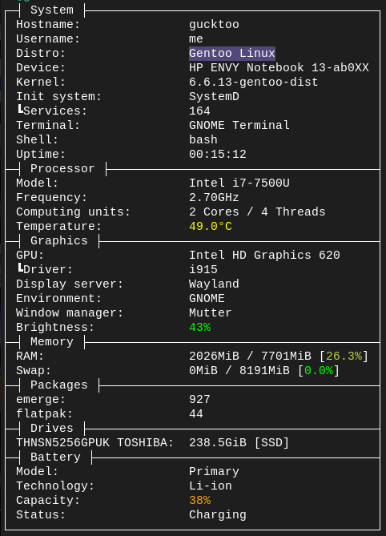
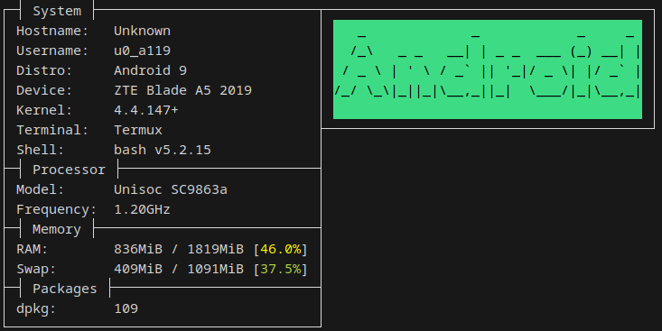

<div align="center">
  
# SCU
Command-line system fetch utility written in [Rust](https://www.rust-lang.org)
  
### Currently supported operating systems


</div>

## Screenshots
<details height="100px"><summary>Gentoo</summary>
<div>


</div>
</details>
<details height="100px"><summary>Manjaro</summary>
<div>


</div>
</details>
<details height="100px"><summary>Android</summary>
<div>

> Running in termux


</div>
</details>

## Usage

**You can download latest release of scu from [releases](https://github.com/omnitix/scu/releases/latest) or compile it by yourself**

### CLI flags

* `--simplify`

  Outputs information in a much simpler form, forced by default when output is piped
* `--ignore-pipe`

  Outputs information in regular form, even if it's piped (disables --simplify forcing)
* `--whale`

  Replaces ascii art with beautiful whale 🐳

### Configuration

scu generates default config at `~/.config/scu` when you first start it.
Config format is ordered scu features, separated by commas, the default is `system,processor,graphics,memory,packages,drives,battery`.
Entries that doesn't exists will be ignored.

## Compilation

1. Install Rust toolchain.
2. Clone scu and compile it with cargo.

``` shell
$ git clone https://github.com/omnitix/scu
$ cd scu
$ cargo build --release
```

Compiled binary is located at `target/release/scu`.

3. Install systemwide (optional)
```
# cp target/release/scu /usr/local/bin
```

### Support development
Monero ```48yd2LY19xAap9sj4aCQNxHN3Z2XFRw1mRurmSNCR3jiLDKsNtRhDKC6rtwcj3Ji5FjgFUuvZy3jPjghg9gzFiJDErXdZfE```
