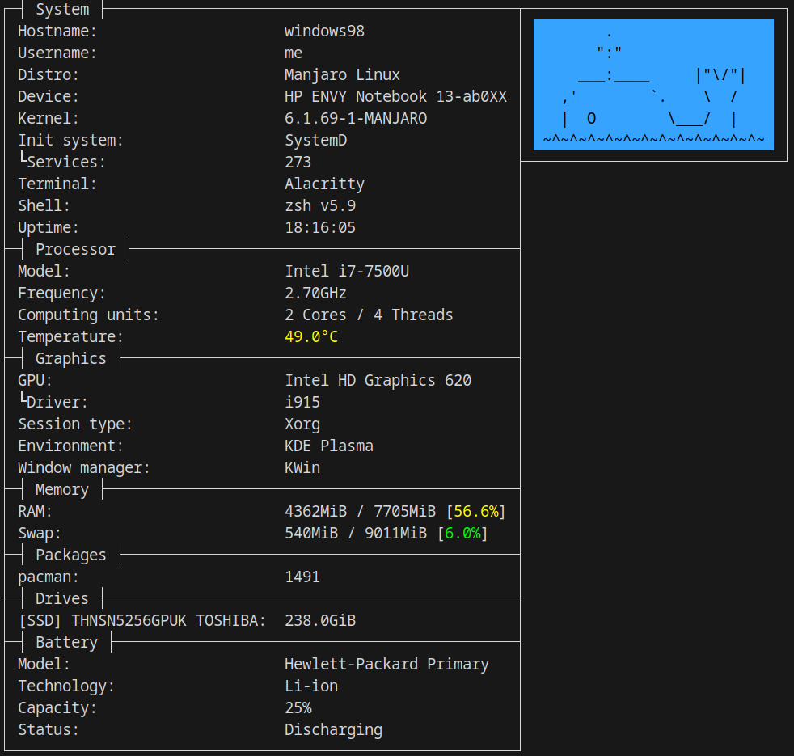

<div align="center">

# SCU

command-line system fetch utility written in [Rust](https://www.rust-lang.org)

### Currently supported operating systems


</div>

## Screenshots

<details height="100px"><summary>Gentoo</summary>
<div>


</div>
</details>
<details height="100px"><summary>Manjaro</summary>
<div>


</div>
</details>
<details height="100px"><summary>Android</summary>
<div>

> Running in termux


</div>
</details>

## Usage

**You can download latest release of scu from [releases](https://github.com/omnitix/scu/releases/latest) or compile it by yourself**

### CLI flags

<details><summary>--stdout</summary>

> prints info in simplified format \
  also simplified format works automatically when scu's output is piped \
  you can use it if you wanna parse scu's output

```
- System
Hostname: windows98
Username: me
Distro: Manjaro Linux
Device: HP ENVY Notebook 13-ab0XX
Kernel: 6.1.69-1-MANJARO
Init system: SystemD
  Services: 275
Terminal: Alacritty
Shell: zsh v5.9
Uptime: 20:41:48
- Processor
Model: Intel i7-7500U
Frequency: 2.70GHz
Computing units: 2 Cores / 4 Threads
Temperature: 65.0°C
- Graphics
GPU: Intel HD Graphics 620
  Driver: i915
Session type: Xorg
Environment: KDE Plasma
Window manager: KWin
- Memory
RAM: 3633MiB / 7705MiB [47.2%]
Swap: 1192MiB / 9011MiB [13.2%]
- Packages
pacman: 1521
- Drives
[SSD] THNSN5256GPUK TOSHIBA: 238.0GiB
- Battery
Model: Hewlett-Packard Primary
Technology: Li-ion
Capacity: 89%
Status: Charging
```

</details>

<details><summary>--whale</summary>

> replaces ascii art (distro's name) with whale



</details>

### Configuration
When you starting scu at first time it automatically generates default config. \
Config path - ```~/.config/scu```

Config format is just elements separated by `,` \
Default config is ```system,processor,graphics,memory,packages,drives,battery```. You can change the order and remove/add entries as you wish

Entries that doesn't exists will be ignored

## Compilation
1. **Install rust with instruction from [Rust official website](https://www.rust-lang.org/tools/install)**

2. **Run this command in SCU directory**
  ```
  cargo build --release
  ```
  
> After compilation binary file will be located in ```./target/release/``` \
  Name of binary file ```scu``` \
  So full path will be ```./target/release/scu```

> Also you can install scu to your system by copying release binary to /usr/bin directory
``` shell
sudo cp target/release/scu /usr/bin && sudo chmod +x /usr/bin/scu
```

### Support development
Monero ```48yd2LY19xAap9sj4aCQNxHN3Z2XFRw1mRurmSNCR3jiLDKsNtRhDKC6rtwcj3Ji5FjgFUuvZy3jPjghg9gzFiJDErXdZfE```
