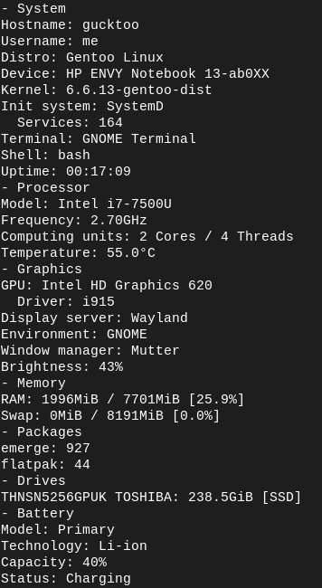
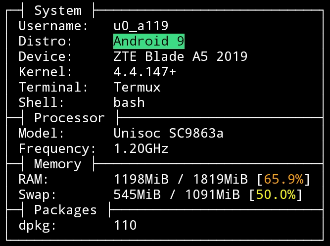

<div align="center">

# SCU
Command-line system fetch utility written in [Rust](https://www.rust-lang.org)

### Currently supported operating systems


</div>

## Screenshots
<details height="100px"><summary>Gentoo</summary>
<div>


</div>
</details>
<details height="100px"><summary>with --simplify</summary>
<div>


</div>
</details>
<details height="100px"><summary>Android</summary>
<div>

> Running in termux


</div>
</details>

## Usage

**You can download latest release of scu from [releases](https://github.com/srtnnm/scu/releases) or compile it by yourself**

### CLI flags

* `--config`

  Name or absolute path to the config

* `--simplify`

  Outputs information in a much simpler form, forced by default when output is piped

* `--ignore-pipe`

  Outputs information in regular form, even if it's piped (disables --simplify forcing)

* `--force-versions`

  Enables version fetching (was disabled by default in commit [a0c0bada](https://gitlab.com/omnid/scu/-/commit/a0c0badaa2b506496558797c3a02957ece0f3ff9#9541a669da5368e41d92810535106685569e34d0_54_52) due to bad performance)

* `--raw-models`

  Show models (CPU, GPU, etc.) without processing

* `--multicpu`

  Show multiple cpus instead of single cpu (currently unstable!)

* `--neomimic`

  Mimic the legendary [neofetch](http://github.com/dylanaraps/neofetch/)

* `--no-colors`

  Disable colors in output

* `--no-logo`

  Don't print logo in neomimic mode

* `-v`, `--version`

  Prints scu's version

* `-h`, `--help`

  Prints help page

### Configuration

See [Configuration documentation](./CONFIGURATION.md) for details.

## Compilation

1. Install Rust toolchain.
2. Clone scu and compile it with cargo.

``` shell
$ git clone --depth=1 https://gitlab.com/omnid/scu
$ cd scu
$ cargo build --release
```

Compiled binary is located at `target/release/scu`.

3. Install systemwide (optional)
```
$ cp target/release/scu /usr/local/bin
```
