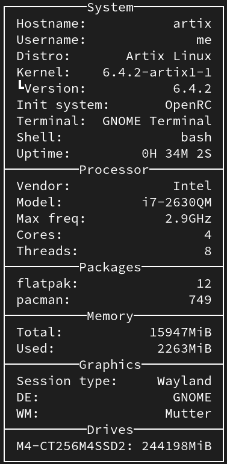

# SCU (System Check Utility)

## Compilation
- Install rust with instruction from [rust official website](https://www.rust-lang.org/tools/install)
- Run this command in SCU directory
  ```
  cargo build --release
  ```

## How to run
- Run this command in SCU directory
  ```
  cargo run
  ```

### How it looks like

